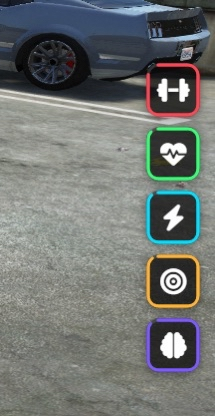

# 🧪 WSS Aura – Buff System



A simple, clean **buff system for FiveM** that provides temporary boosts such as speed, stamina, intelligence, and strength. Buffs are displayed on-screen, persist through reconnects, and automatically expire.

> ⚡ Lightweight • 🔒 Server‑authoritative • 💾 Persistent

---

## ✨ What Are Buffs?

Buffs are **temporary bonuses** applied to your character. Once active, they:

* Appear on your screen with a timer
* Automatically apply their effect
* Expire on their own
* Resume if you disconnect and reconnect (if time remains)

You do **not** need to manage anything manually.

---

## 🧬 Available Buffs

| Buff             | Effect                                             |
| ---------------- | -------------------------------------------------- |
| **Speed**        | Increases run & sprint speed                       |
| **Stamina**      | Regenerates stamina continuously                   |
| **Focus**        | Designed for Progress Bar Time Reduction           |
| **Intelligence** | Increases time allowed in supported minigames      |
| **Strength**     | Increases inventory carry weight                   |

> Buff effects and durations are fully controlled by the server configuration.

---

## ⏱️ Buff Timers

* Each buff shows a **countdown timer**
* Re-applying the same buff **extends** its duration
* Buffs automatically disappear when they expire

No action is required from the player.

---

## 🔁 Persistence (Reconnect Safe)

If you:

* Disconnect
* Crash
* Relog

Your buffs will be **restored automatically** with the remaining time.

---

## 🖥️ User Interface

* Buffs are displayed on the screen
* Each buff shows:

  * Name
  * Remaining duration
* UI updates automatically when buffs are added, extended, or removed

---

## ❓ Frequently Asked Questions

### Do buffs stack?

Yes. Applying the **same buff again extends its timer**.

### Can I have multiple buffs at once?

Yes. You can have **multiple different buffs active simultaneously**.

### Do I lose buffs on death?

No. Buffs only expire when their timer runs out or if removed by the server.

### Do buffs affect everyone the same?

Buff strength and duration are **server-controlled** and apply equally unless customized.

---

## 🔌 Available Exports

These exports are provided for other resources to interact with the buff system.

### 🖥️ Client Exports

Check if specific buffs are active:

```lua
exports['wss-aura']:IsSpeedActive()
exports['wss-aura']:IsStaminaActive()
exports['wss-aura']:IsFocusActive()
exports['wss-aura']:IsIntelligenceActive()
exports['wss-aura']:IsStrengthActive()
```

Generic buff checks:

```lua
exports['wss-aura']:HasBuff(buffName)       -- returns boolean
exports['wss-aura']:GetBuffTime(buffName)   -- returns seconds remaining
```

Intelligence helper (for minigames):

```lua
exports['wss-aura']:GetBuffedIntelligenceDuration(baseDuration)
```

---

### 🗄️ Server Exports

Apply a buff to a player:

```lua
exports['wss-aura']:ActivateBuff(source, buffName, duration)
```

Check buff state server-side:

```lua
exports['wss-aura']:IsBuffActive(source, buffName)
exports['wss-aura']:GetBuffTime(source, buffName)
```

---

## 🧩 Buff Integration Examples

Below are practical examples showing how to integrate **wss-aura buffs** into common FiveM systems.

---

### 🚀 Triggering a Buff from Client (Server Event)

Use this when a player consumes an item, finishes an action, or earns a reward.

```lua
-- Apply a speed buff using the server event
TriggerServerEvent('buffs:server:requestBuff', 'speed', customBuffs.speed)
```

**Parameters:**

* `speed` → Buff name
* `customBuffs.speed` → Duration in seconds (optional, defaults to config)

---

Below are practical examples showing how to integrate **wss-aura buffs** into common FiveM systems.

---

### 🎯 Focus Buff – Faster ox_lib Progress

```lua
local focus = exports['wss-aura']:IsFocusActive()
local duration = data.duration

if focus then
    duration = (data.duration * 2) / 3 -- 33% faster
end

lib.progressBar({
    duration = duration,
    label = data.label or 'Working...',
    canCancel = true,
})
```

---

### 🧠 Intelligence Buff – Minigame Time Bonus

```lua
local baseTime = 5000
local newTime = exports['wss-aura']:GetBuffedIntelligenceDuration(baseTime)

-- pass newTime into your minigame
```

**Effect:** Gives players more time to complete skill-based actions.

---

### 🏃 Speed Buff – Conditional Logic

```lua
if exports['wss-aura']:IsSpeedActive() then
    -- allow faster movement-based interaction
end
```

---

### 💪 Strength Buff – Weight-Based Checks

```lua
if exports['wss-aura']:IsStrengthActive() then
    -- player can carry heavier items
end
```

---

### 🔍 Generic Buff Check

```lua
if exports['wss-aura']:HasBuff('stamina') then
    -- stamina-related logic
end
```

Get remaining time (seconds):

```lua
local timeLeft = exports['wss-aura']:GetBuffTime('stamina')
```

---

## 🛑 Important Notes

* Buff effects are automatic
* Buffs cannot be manually removed by players
* Exploits are prevented server-side

---

## 📦 Dependencies

This resource requires the following dependencies to function correctly:

* **community_bridge** – Framework abstraction (ESX / QBCore compatibility)
* **oxmysql** – Database persistence for buffs
* **ox_lib** – Command system and utilities
* **lation_ui** – UI initialization support
* **ox_inventory** – Required for the **Strength** buff (inventory weight increase)

> ⚠️ If `ox_inventory` is not installed, the Strength buff will have no effect.

---

## ❤️ Credits

Developed by **WSS-Development**
Buff System by **zStretz**

---

If you experience issues or have questions, contact a server administrator.
